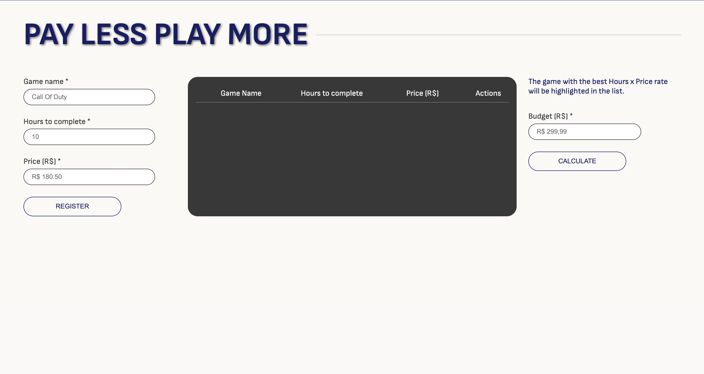
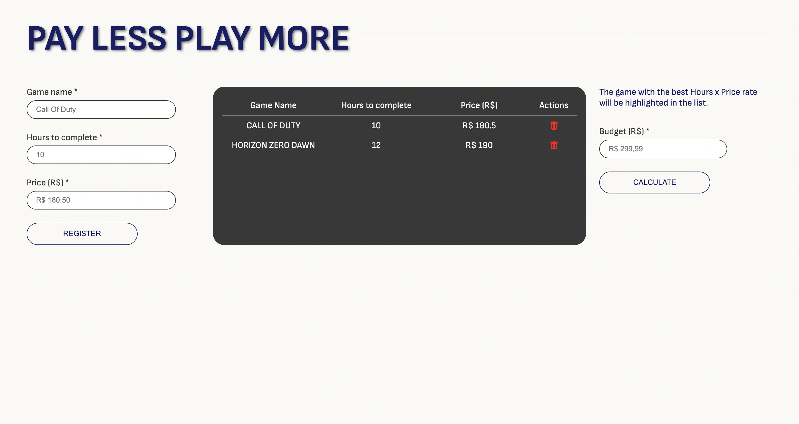
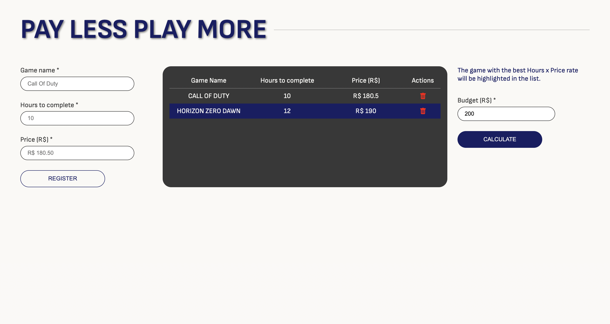

# Pay less Play More

**Número da Lista**: 36<br>
**Conteúdo da Disciplina**: PD<br>

## Alunos
| Matrícula | Aluno                                                |
| --------- | ---------------------------------------------------- |
| 170144488 | [Henrique Melo](https://github.com/HenriqueAmorim20) |
| 180122258 | [Igor Queiroz Lima](https://github.com/igorq937)     |

## Apresentação

https://github.com/projeto-de-algoritmos/PD_PayLess-PlayMore/blob/master/video.mp4

## Sobre 
A partir de uma lista de jogos que podem ser cadastrados (nome, preço e horas até completar) e qual o máximo que pode ser gasto, é mostrado ao usuário qual jogo ele tem o maior tempo de gameplay pelo dinheiro gasto.

## Screenshots
</br>
</br>
</br>

## Instalação 
**Linguagem**: Javascript<br>
**Framework**: Angular<br>

O projeto está disponível em: https://pd-pay-less-play-more.vercel.app/

Ou com o **[Node.JS](https://nodejs.org)** instalado, execute os comandos dentro da pasta do projeto:

```bash
npm install
npm start
# Tecle Control + C para encerrar
```


